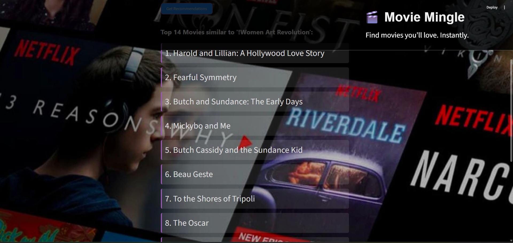

# 🎬 Movie Mingle

**Movie Mingle** is a movie recommendation system where users can simply enter the name of a movie and receive personalized, similar movie suggestions using natural language processing.

🌐 **Live Demo**: [Click here to try it out!](https://movie-mingle-8.streamlit.app/)

---

## 📌 Features
- 🔎 Search and select a movie
- 🤖 Get intelligent movie recommendations
- 🎨 Responsive UI with background styling
- 📱 Mobile-friendly layout
- 🚀 Deployed using Streamlit Cloud

---

## 🛠 Tech Stack
- Python
- Pandas
- Scikit-learn (TF-IDF & Cosine Similarity)
- Streamlit
- HTML/CSS (for styling)

---

## 📸 Preview

 

---

## 📦 Setup Locally


```bash
git clone https://github.com/YourUsername/Movie-Mingle.git
cd Movie-Mingle
pip install -r requirements.txt
streamlit run app_1.py
